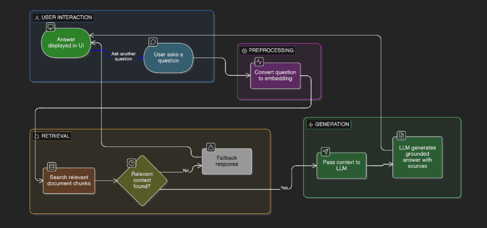

# ✦ Stella — LLM-Powered FAQ Assistant

An AI-powered FAQ assistant that answers questions from your own documents using **Retrieval-Augmented Generation (RAG)**. Ask anything in plain English — Stella searches your knowledge base, retrieves the most relevant context, and generates a grounded answer with cited sources.

---

## 🧠 How It Works

```
User asks a question
        ↓
Stella converts it to a semantic embedding
        ↓
ChromaDB searches for the most relevant document chunks
        ↓
Retrieved context is passed to the LLM (via Ollama)
        ↓
LLM generates a grounded answer with sources
        ↓
Answer displayed in Streamlit UI with typewriter effect
```

---
## Project Workflow



---

## ⚙️ Tech Stack

| Layer | Technology |
|---|---|
| Frontend | Streamlit |
| Backend | FastAPI + Python |
| LLM | Ollama (llama3.2:1b or any model) |
| Embeddings | LangChain FastEmbedEmbeddings |
| Vector DB | ChromaDB |
| Orchestration | Docker Compose |


> CPU-only machines work but responses will be slow. Remove the `deploy.resources` GPU block from `compose.yaml` if you don't have a GPU.

---

## 🚀 Option A — Run From Source Code (GitHub)

### 1. Clone the repo

```bash
git clone https://github.com/yrarjun59/FAQ-Assistant.git
cd FAQ-Assistant
```

### 2. Configure environment (optional)

```bash
cp .env.example .env
# edit .env to change models or API URLs if needed
```

### 3. Start everything

```bash
docker compose up --build
```
#### installed ollama model or takes more time for that 

This will automatically:
- Build backend and streamlit images
- Start Ollama server
- Pull `llama3.2:1b` models
- Start the API and UI

### 4. Open the app

```
http://localhost:8501
```

---

## 🐳 Option B — Run Without Source Code (Docker Hub)

Only requires Docker Desktop. No code needed.

### 1. Download the production compose file

Save `compose-prod.yaml` from this repo or copy it from below.

### 2. Start everything

```bash
docker compose -f compose-prod.yaml up
```

### 3. Open the app

```
http://localhost:8501
```

Then run:

```bash
docker compose up --build
```

> The backend will now use your existing Ollama installation instead of spinning up a new container. Make sure your required models are already pulled: `ollama pull llama3.2:1b`

---

## 🔧 Configuration

Copy `.env.example` to `.env` and edit as needed:

```bash
# Model selection
LLM_MODEL=llama3.2:1b           # LLM for answer generation

# API URLs (change only if running outside Docker)
OLLAMA_BASE_URL=http://ollama:11434
STELLA_API_URL=http://backend:8000
```


## 📥 Adding Your Own Documents

Place your FAQ or documentation files inside `backend/knowledge/`:

```
backend/
└── knowledge/
    ├── doc1
    ├── doc2
```

Then run the ingestion script to embed and index them: make sure documents should be in json format check my samples for larger documets have to chunking


```bash
docker exec backend_api python ingest.py
```


## 🔄 Getting Updates

### From Source (Option A)

```bash
git pull
docker compose up --build
```

### From Docker Hub (Option B)

```bash
docker compose -f compose-prod.yaml pull
docker compose -f compose-prod.yaml up
```